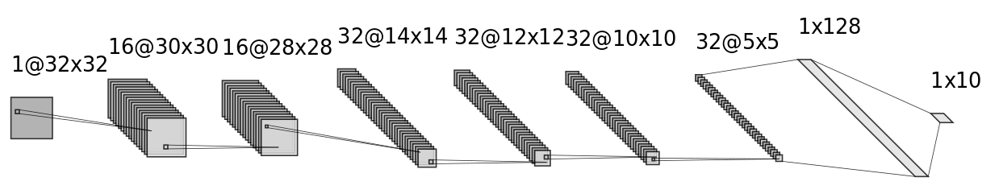

# MNist
The [MNist](http://yann.lecun.com/exdb/mnist/) dataset consists of monochrome (black and white) images of 28 by 28 pixels of handwritten digits (0 to 9), with a training set of 60,000 images and a test set of 10,000 images. The goal for the models is to predict the correct digit (0 to 9) based on the image.

## Models
I have tested three different types of models for which there are two variants each. The first type of model is the feature model with the "Shallow features" and "Simple features" being the two variants. The second type is the fully connected neural network(FCNN) with a shallow and a simple version. Lastly, the convolutional neural network (CNN) has a simple variant and a double variant.  
Both the feature network and the FCNN have a shallow variant and a 'deep' variant. The shallow variant, as the name suggests, is shallow and only has an input and output layer, while the 'deep' variants have a hidden layer as well. This hidden layer has 256 neurons.
### Feature model
The feature model does not use the image itself to predict the label, but instead uses ten pre-computed features. These features then act as the input layer of a FCNN.
The ten features used are: average pixel value, percentage of pixels with a minimum value (0.5), the major eigenvalue, the minor eigenvalue and six features based on the bounding box, height, width, left, right, top, bottom. The reason that the features based on the bounding box are valid for this dataset is the normalisation of the digits done by the authors of the dataset (e.g., the digits were centered). The advantage of this feature model is the small size of the networks but it also comes with some major disadvantages. First of all, the performance is significantly lower than that of the FCNN and CNN. The second disadvantage is the computation time required for computing the feature values.  

### Fully connected neural network
The fully connected neural network(FCNN) first flattens the image (28x28) into an array of 784x1 which then acts as the input layer of the network. The model works the same as any other FCNN. One advantage of the FCNN is the higher performance than the feature model because every pixel can individually impact the next layer and thus the result. Moreover, the FCNN is better at taking the spatial information into account. One disadvantage is that the models grow quickly compared to the feature network and CNN, as adding a hidden layer will result in a major increase in the number of parameters.

### Convolutional neural network
The convolutional neural network (CNN) does not adjust the image using man-made processes in any way (no flattening or computing features) but instead uses two stages to process it. The first stage is the convolutional stage, where a 'filter' is moved over the image from left to right, top to bottom. This stage combines information from multiple pixels to reduce the number of neurons needed for the second stage. The second stage is the fully connected stage, which is essentially a small FCNN. The CNN has a number of advantages over the other model types, such as being spatial invariant, while it can take the spatial information into account. CNNs also tend to be smaller in terms of number of parameters, but this advantage is more pronounced with larger images. 
NOTE: the second variant "Double Ch." has the same network architecture but double the channels.

## Results
As can be seen in the figure below, the feature model performs worst on the MNist dataset, but the two variants have the fewest number of parameters. This can be a good thing as succesfully training a model with a lot of parameters requires a lot of training data. For the MNist dataset this is not really a problem. But while the feature model has very few parameters, the two variants benefit most from multiple epochs, while the FCNN and CNN variants already have a high accuracy after one epoch and only marginally increase their performance with additional epochs of training. For a straightforward task such as classifying the handwritten digits, a hidden layer does not have a huge impact on the performance of the FCNN model (a 0.05 difference in performance). Overall the CNN performs the best while they have less parameters than the FCNN variants.
 
  
NOTE: the number behind the name of the model variant indicates the number of trainable parameters.  
| Network           | 1 epoch    | 2 epochs | 5 epochs | 10 epochs |
| :--------------- | ---------: | ----------: | ----------: | ----------: |
| Shallow features | 0.3495     | 0.4544 | 0.5612 | 0.6068 |
| Simple features  | 0.5560 | 0.5916 | 0.6895 | 0.7161 |
| Shallow fully connected | 0.9166 | 0.9209 | 0.9246 | 0.9252 |
| Simple fully connected | 0.9669 | 0.9709 | 0.9780 | 0.9795 |
| Simple CNN | 0.9677 | 0.9753 | 0.9832 | 0.9830 |
| Double Ch. CNN | 0.9787 | 0.9769 | 0.9856 | 0.9872 |  

# Cifar10
Like the MNist dataset, the [Cifar10](http://www.cs.toronto.edu/~kriz/cifar.html) dataset consists of small images, 32 by 32 pixels, with 50,000 training images and 10,000 test images. But unlike the MNist dataset the images are colored instead of monochrome. The dataset has ten classes (airplane, automobile, bird, car, deer, dog, frog, horse, ship, truck) with an equal distribution of training and test images per class.

## Models
The models used for the Cifar10 dataset are similar to the ones used for the MNist set, as can be seen in the graph below. The feature variants are no longer present as using hand-written features becomes more difficult for colored images as there are three channels (RGB) instead of one and the classes are harder do describe than the digit classes. There are eight variants, spread over three types: the FCNN, the simple CNNs and the double convolution CNNs.

### Fully connected neural network
There are two FCNN variants, one shallow (only input and output layer) and one with a hidden layer with 256 neurons. The input layer has 1024 (32x32) neurons which causes the two variants to have many parameters. The 'deep' variant actually has the most parameters of all variants with 789258 parameters.

### Convolutional neural network
There are six variants, three simple variants and three CNNs with double convolutions. These double convolution variants have two convolutional layers in sequence, while the simple variant has a pooling layer after each convolutional layer. Two variants start of with 16 channels, while the other four start with 32 and two of those also use dropout, with a value of 0.2, to improve the performance. Dropout is a method for making a model more robust by "turning off" certain connections in the model with a certain probability (0.2 in this case). Because the connections are "turned off", the network cannot rely on those connections for its prediction. Hence, the other connections need to take over the work. The dropout is added after every pooling layer and after the dense/fully connected layer when it is a dropout variant.
 
The figure above shows the architecture of the simple CNN model (16 channels variant) where the first square is the input image, and the stacks of squares after it are the results of convolutional/pooling layers. The network consists of three sets of convolutional layer and a max-pooling layer with a the output layer ("1x10") at the end. For the two variants with 32 channels, the number of channels would be 32, 64 and 128 for the three sets  
 
For the CNN variants with double convolutions the network consists of two sets with two consecutive convolutional layers followed by a max pooling layer. 

## Results
NOTE: normally this type of analysis, or at least the largest part, is done using the validation set instead of the test set. 
The first difference between performance on the mnist and cifar10 datasets is that for the cifar10 dataset, all variants benefit (significantly) from more epochs. The FCNN variants do not improve after 15 epochs and only achieve accuracies of approximately 39% and 45%. This is not terrible (randomly guessing a label will give an accuracy of 10%) but the accuracy can be improved significantly by using a CNN instead, while this would also reduce the number of parameters. For the simple CNNs the accuracy does not improve more than a percentage point or two after 15 epochs as well and with accuracies of 71%, 73% and 77% they outperform the FCNNs by a large margin. The CNN variants with double convolutions perform better than the simple variants but this comes with a severe increase in number of parameters, which makes them harder to train and slower to predict.  
Overall, the best performing variant is the Simple CNN with 32 channels and dropout with an accuracy of 77% after 35 epochs. If we were to limit the number of epochs to a more reasonable number such as 15, the CNN with double convolutions, 32 channels and dropout performs better with 76% versus 75% for the simple dropout version.

  
NOTE: the number behind the name of the model variant indicates the number of trainable parameters.  
| Method           | 1 epoch    | 5 epochs    | 10 epochs   | 15 epochs   | 25 epochs   | 35 epochs  | 50 epochs  |
| :--------------- | ---------: | ----------: | ----------: | ----------: | ----------: |----------: |----------: |
| Shallow fully connected               | 0.3399 | 0.3674 | 0.3296 | **0.3859** | 0.3628 | 0.3262 | 0.3820 |
| Fully connected                       | 0.3655 | 0.4279 | 0.4443 | **0.4547** | 0.4374 | 0.4381 | 0.4515 |
| Simple CNN 16 channels                | 0.5146 | 0.6468 | 0.6909 | 0.7009 | 0.7082 | **0.7170** | 0.7014 |
| Simple CNN 32 channels                | 0.5937 | 0.6936 | 0.7199 | **0.7304** | 0.7102 | 0.7057 | 0.7042 |
| Simple CNN 32 channels, dropout       | 0.5642 | 0.6822 | 0.7269 | 0.7450 | 0.7685 | **0.7735** | 0.7720 |
| CNN double conv. 16 channels          | 0.5546 | 0.6971 | 0.7127 | **0.7157** | 0.6972 | 0.6875 | 0.6810 |
| CNN double conv. 32 channels          | 0.5573 | 0.7211 | **0.7237** | 0.7203 | 0.7106 | 0.7166 | 0.7033 |
| CNN double conv. 32 channels, dropout | 0.5524 | 0.6961 | 0.7512 | 0.7626 | 0.7726 | 0.7719 | **0.7728** |

# Discussion
Using hand-written features for classifying images is not always a viable possibility, as larger and more complicated images make creating such features much more complicated. Additionally, the results of networks using such features is not great. Implementing better features is possible, but also takes more time and this might not be worth the trade-off as both FCNN and CNNs perform better without requiring much attention.  
Using a FCNN for classifying images is possible but quickly becomes a bad choice as the resolution of images grows and the images are no longer monochrome. As a simple rule of thumb, a FCNN needs an input layer of Channels (3 for RGB) * width * height, or 30,000 for a color image of 100 by 100 pixels. Then when the next (hidden) layer has a modest 100 neurons, there will be 100 * (30,000 + 1) = 3,000,100 connections or parameters (the + 1 is for the bias).  
CNNs are clearly the best option as they have fewer parameters (in general) and are thus easier to train while they also obtain higher accuracies. Adding dropout layers can make the model more robust and improve the performance. Increasing the number of channels can also increase performance but the improvement is small and also results in more than double the number of parameters.  
Overall, having more parameters slows down the training and test time, but not all parameters are equal as parameters (connections) in the convolutional stage of a CNN are generally slower than fully connected parameters. And increasing the number of epochs can help models, especially when the images are more complicated and there are less images available, but increasing the number of epochs too much will result in overfittig and can actually decrease the performance. (That is why the highest performance for the model variants isn't necessarily with 50 epochs, last column in the table above)

